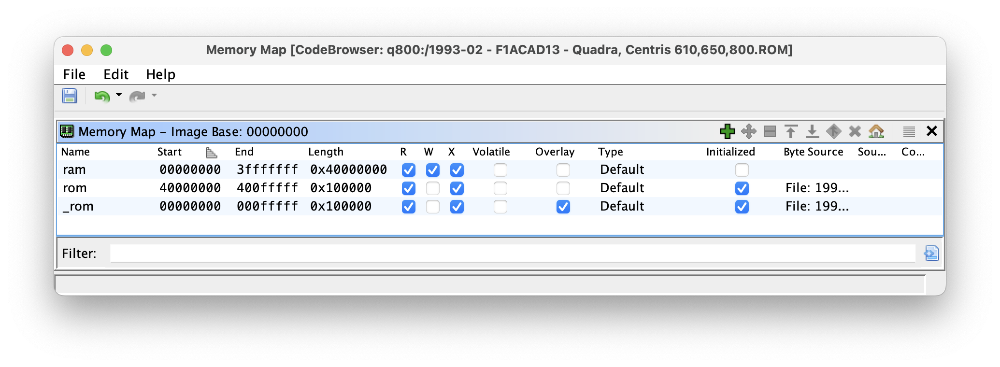

# q800-rom-hacking
Disassembling and annotating the Q800 ROM in Ghidra (Quadra/Centris 610,650,800 checksum F1ACDA13)

## scripts/

Some assorted (and very unfinished) scripts for Ghidra.

### AnnotateRomTables.py

Based on [unirom](https://github.com/rb6502/unirom) by rb6502, read the machine support tables from the ROM and annotate all the machine support tables and their entries.

I've written some structs and data types for Ghidra to be able to better resolve references to this data. This greatly helps in understanding the code that uses it as the decompiler view will have correct field names, rather than random integer offsets into memory.

Structs:
- machineInfo - struct for each machine in Universal tables
- hwCfgFlags - bitfield found at machineInfo[0x10]
- baseAddrFlags - bitfield found at machineInfo[0x18]
- addrDecoderInfo - struct for address decoder type found 24 bytes before relative offset stored in machineInfo[0x0]
- addrDecoderInfo_public - "shifted pointer" typedef that shifts the pointer 24 bytes back so that Ghidra gets the correct field names in the decompiler view for the fields before the pointer.

Enums:
- boxInfo - enum for computer names at machineInfo[0x12]
- memDecoderType - enum for memory decoder type at machineInfo[0x13]

### FixupBSR6.py

In early boot, a lot of functions use the "BSR6" calling convention - return address is stored in register A6. This finds 'lea' addreses that load an offset from PC into A6, directly followed by a JMP to an immediate value. At this point, it initiates disassembly past the JMP instruction (to ensure that the code there is disassembled), overrides the flow type of the JMP to Call, so it's treated as a function call that returns back to this point.

This makes the program flow in the decompiler... work.

It then goes to the target of the JMP, and ensures that it has a function assigned to it.

Then, it looks for JMP (A6) instructions and sets their flow type to RETURN. This beats Ghidra's default behaviour which is:

```c
    /* WARNING: Could not recover jumptable at 0x00004ba0. Too many branches */
    /* WARNING: Treating indirect jump as call */
```

... treating it as a giant jump table and assuming it's a call.

### FindRomWrites.py

In order to reverse engineer the early boot process, there's a second copy of the ROM mapped at 0x00000000 (as well as the usual 0x40000000). When the machine first switches on, ROM is mapped to the zero address as well to allow the m68k to load SP from 0x0:4 and PC from 0x4:8. This will remap all the reads/writes in this space into RAM, which they are more likely to be.



### ImportLomemGlobals.py 

A modified version of the low memory globals list from the [Mac Almanac II](http://www.mac.linux-m68k.org/devel/macalmanac.php) is included as `lomem_globals.txt`. This script imports it, setting labels and data types as specified in the file.

### ImportSymbolsShifted.py

A modified version of `ImportSymbolsScript.py` from Ghidra which allows you to import the symbols with a prefix, put them at a memory offset, or in another address space. Used with cy384's [68k-mac-rom-maps](https://github.com/cy384/68k-mac-rom-maps) - converted tables of ROM symbols from MPW 3.5. 

Symbols that I have imported into the "mirror" of ROM that exists in early boot have been prefixed with `__` so they are distinct from the ones at the actual ROM base address.

### RemoveUndefinedTypes.py

After running FindRomWrites.py, you may be left with a bunch of `undefined1`, `undefined2` and `undefined4` data declarations with no references to them, as Ghidra assumes there was data there. This will remove them all, because they stop decompliation of code when hit.

## Useful other repos

- [https://github.com/cy384/68k-mac-rom-maps](https://github.com/cy384/68k-mac-rom-maps)
    - Converted tables of ROM symbols from MPW 3.5.
    - Partial A-Trap instruction decoding

- [unirom](https://github.com/rb6502/unirom)
    - C++ code to decode machine support tables from ROM

- [https://github.com/elliotnunn/supermario](https://github.com/elliotnunn/supermario)
    - Patched version of the `SuperMario` (codename for System 7.1) leaked source.

## ... the ghidra project?

It'll be posted when it's less of a mess...